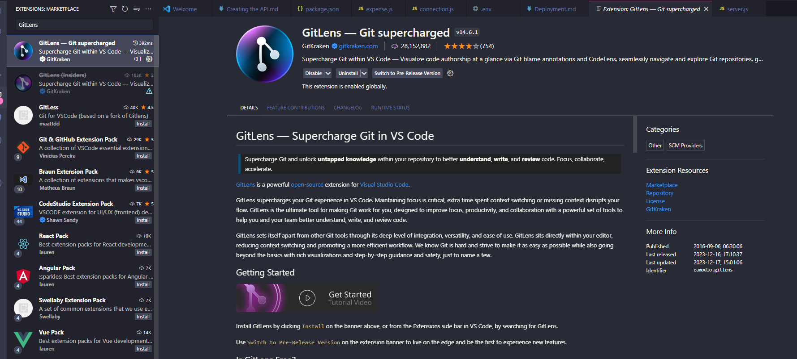
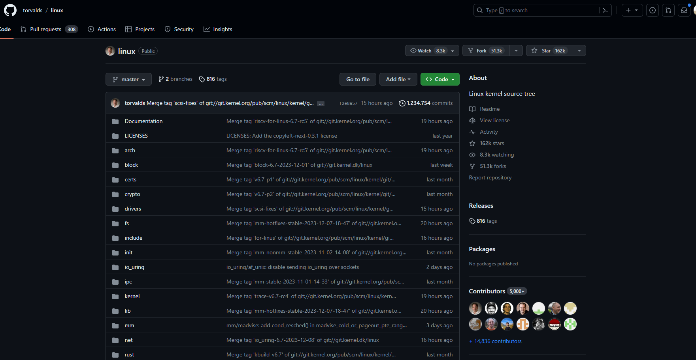

# API Deployment

Services:
- Git
- GitHub
- Render
---

# Git Introduction

- Booking System 01-01-2024
- Booking System 01-03-2024
- Booking System Final
- Booking System Final Bkp
- Booking System Final Final
- Booking System Final Final Final najud Lord

https://git-scm.com/downloads

---

---

# GitLens

---

# GitHub Introduction

[https://github.com](https://github.com/signup?ref_cta=Sign+up&ref_loc=header+logged+out&ref_page=%2F&source=header-home)

---

---

---

# VS Code Sign in with GitHub

---

---

---

# Render Introduction

---

---

# Initializing Git Repository

---

# Exclude files from version control

Create a `.gitignore` file in the working directory and exclude these folders and files:

- node_modules
- .env

---

# Commit the changes

